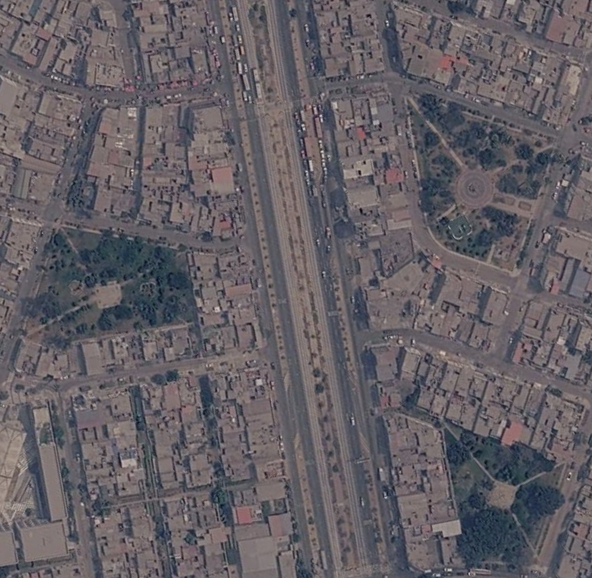
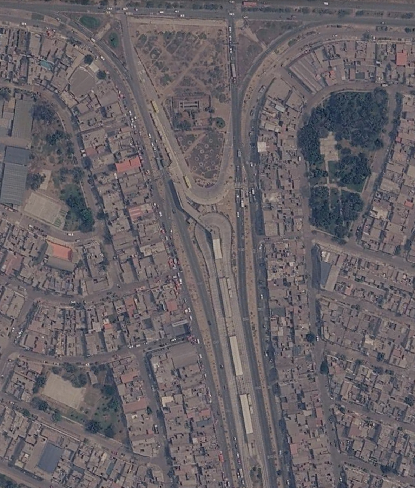
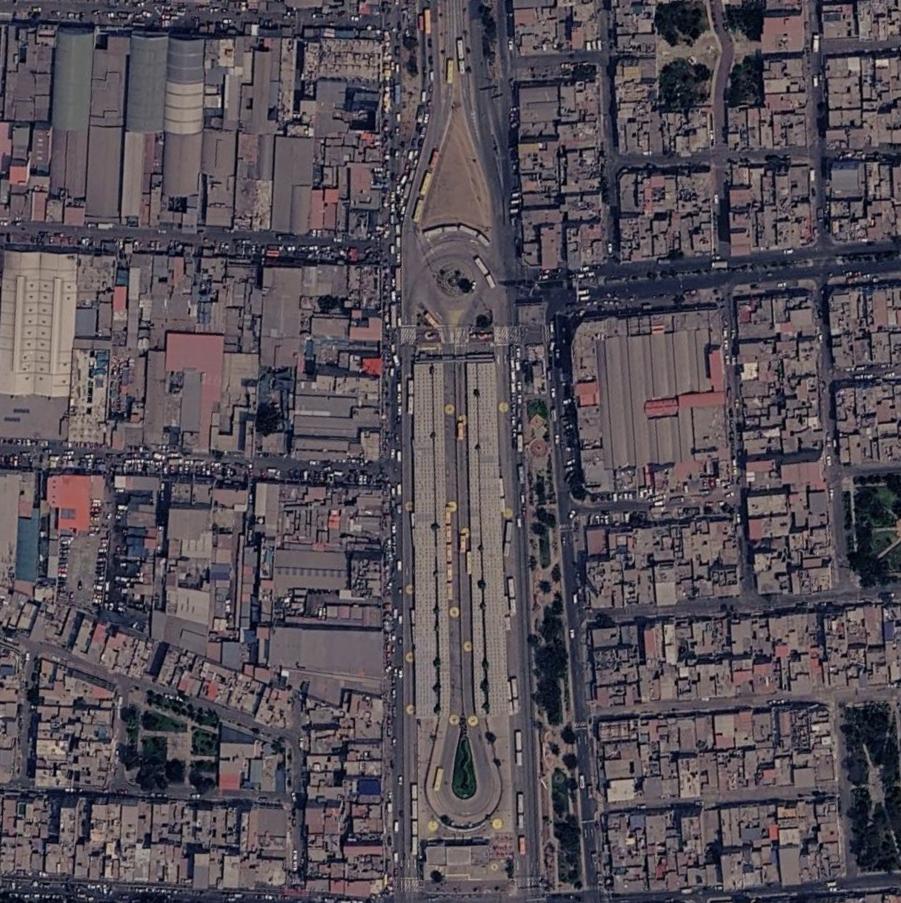
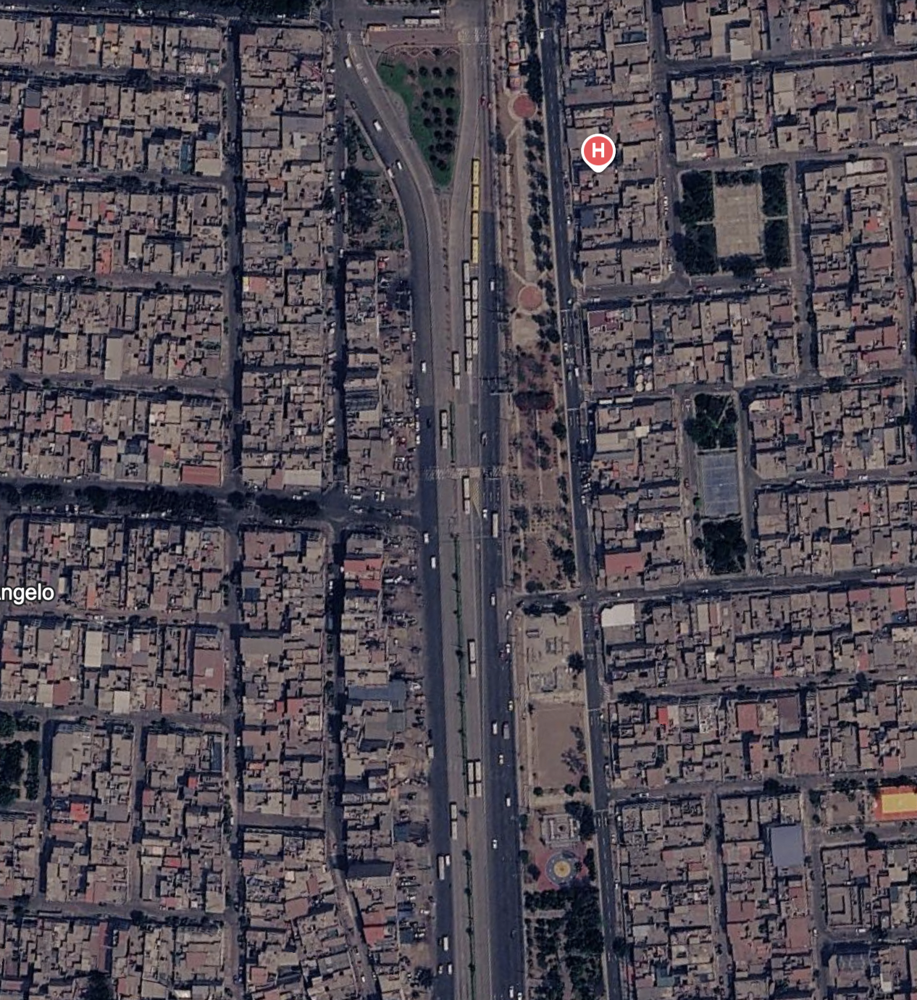
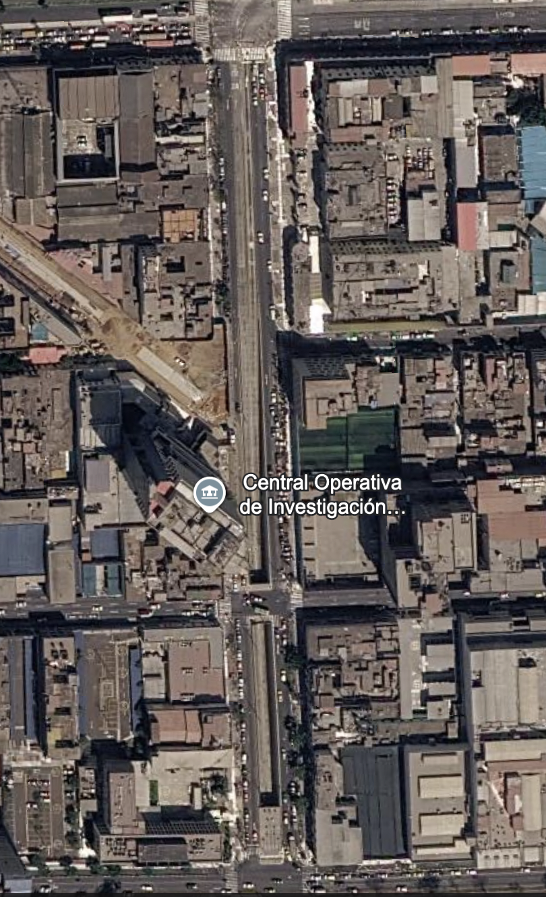
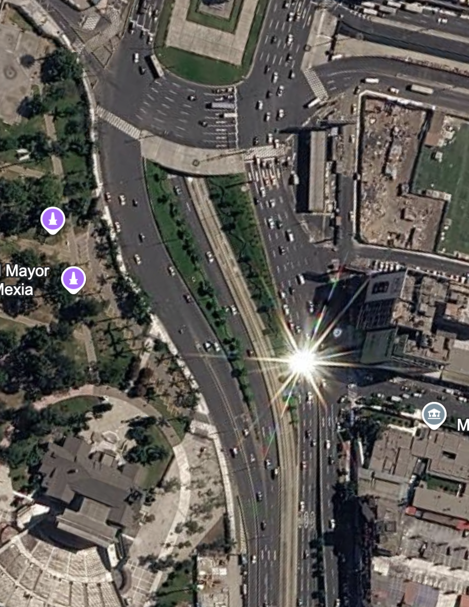
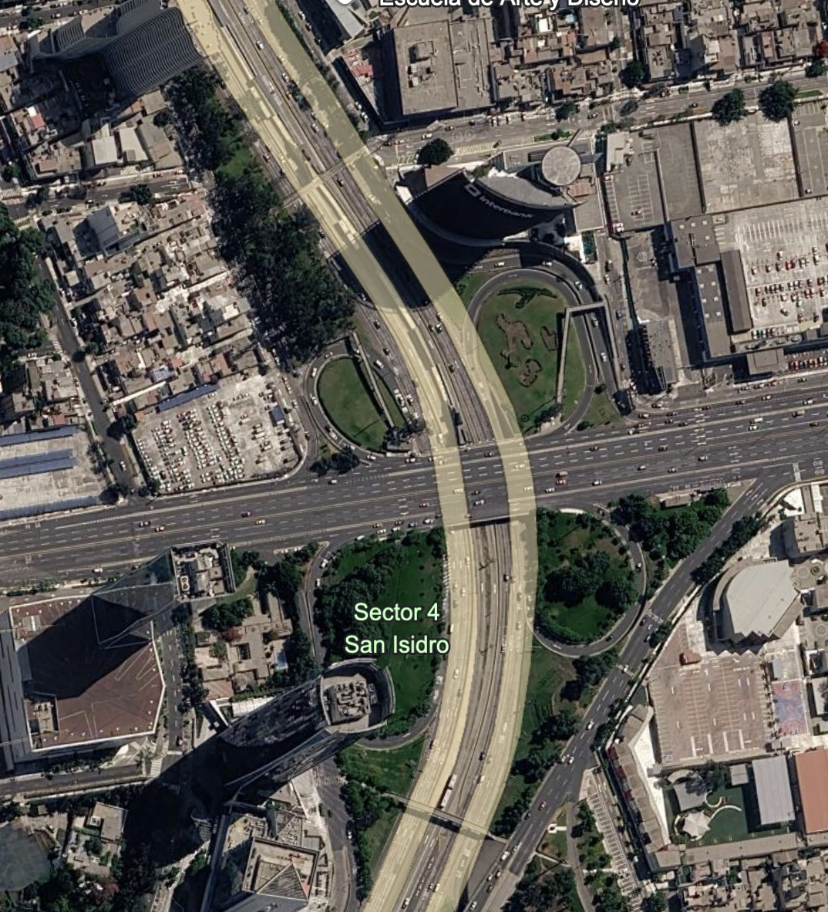
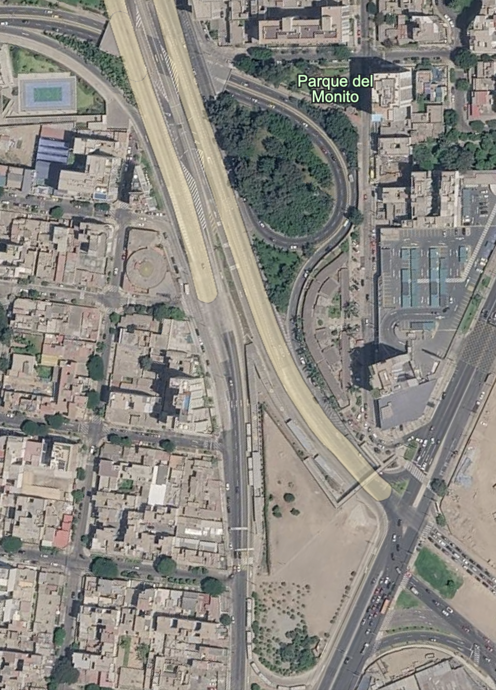
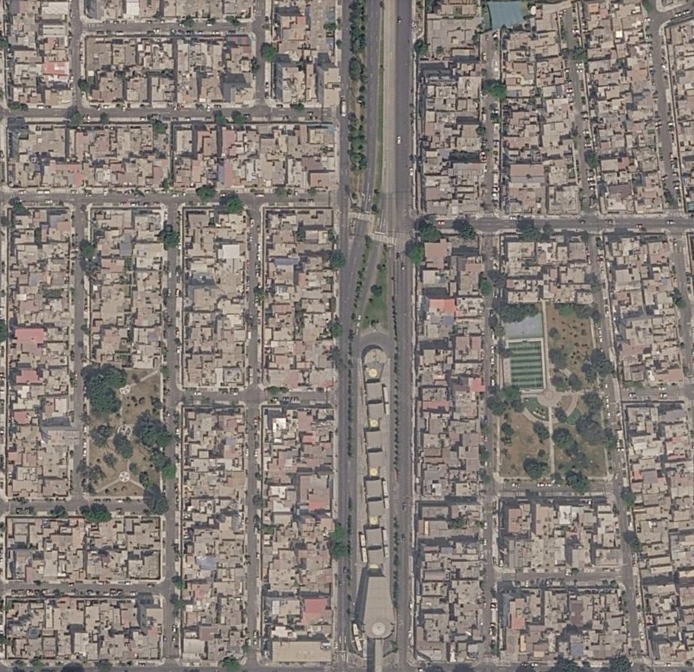

# Reporte Exploratorio

Este reporte está basado en observaciones al utilizar el servicio de transporte público Corredor Metropolitano de Lima, Perú. Existe una diferencia observable entre el diseño, mantenimiento y beneficios a lo largo de la ruta desde Estación Chimpu Ocllo (Lima Norte) hasta Estación Matellini (Lima Sur).

## Metodologia

En este proyecto exploratorio se utilizó Copernicus Browser con imagenes Sentinel-2 L2A y el Índice de Vegetación de Diferencia Normalizada (NDVI, por sus siglas en inglés) para extraer datos sobre la calidad de las áreas verdes que son parte de los proyectos. Estas areas verdes fueron divididas en dos categorias segun su función urbana: 1. Parque Entrada: Corresponde a los espacios públicos verdes de mayor envergadura ubicados en el entorno inmediato de las estaciones elegidas. Esta categoría abarca tanto las zonas consolidadas (con vegetación activa) como aquellas áreas proyectadas que actualmente se encuentran no consolidadas o en estado de degradación. 2. Franjas Verdes: Comprende los componentes longitudinales de infraestructura verde dispuestos a lo largo del corredor de transporte, localizados específicamente en el separador central (mediana) o en los márgenes laterales de los carriles segregados próximos a las estaciones.

# Procesamiento

```{r, echo=FALSE}
library(tidyverse)
library(knitr)
```

```{r, echo=FALSE}
areas_verdes <- read_csv("../Metropolitano/GIS-Copernicus_Metropolitano.csv")
head(areas_verdes,50)
```

```{r}

# Yo recolecté los datos y corregí cualquier incosistencia antes de guardar el archivo csv.

# Orden de los distritos de Norte a Sur

distritos_norte_a_sur <- c("Carabayllo","Independencia","Cercado de Lima", "San Isidro","Barranco/Miraflores", "Chorrillos")

# Promedios 

# Promedios_estaciones_general <- areas_verdes |> 
#   group_by(Distrito) |> 
#   summarize(Promedio_NDVI = mean(NDVI)) |> 
#   mutate(Distrito = factor(Distrito, levels = distritos_norte_a_sur)) |> 
#   arrange(Distrito)
# 
# kable(Promedios_estaciones_general)

Promedios_estaciones_tipo <- areas_verdes |> 
  group_by(Lat,Lon,Distrito, Tipo) |> 
  summarize(Promedio_NDVI = mean(NDVI), .groups = "drop") |> 
  mutate(Distrito = factor(Distrito, levels = distritos_norte_a_sur)) |> 
  arrange(Distrito) 

kable(Promedios_estaciones_tipo)

write_csv(Promedios_estaciones_tipo, "Promedios_estaciones_tipo.csv" )
```

```{r, warning=FALSE}
Promedios_estaciones_tipo |> 
  ggplot(aes(x = Distrito, y = Promedio_NDVI, fill = Tipo)) +
  geom_bar(stat = "identity", position = "dodge") +
  labs(
    x = "Distritos (De norte a sur)", 
    y = "Promedio NDVI (Índice de Vegetación de Diferencia Normalizada)",
    fill = "Tipo de área verde") +
  scale_fill_viridis_d(option = "E", end = 0.85) +
  theme_classic() +
  theme(    legend.position = c(0.18, 0.80))
```

# Reference pictures from Google Earth

::: {#Estaciones .Google .Earth .Web .Screenshots layout-ncol="3" style="Yellow"}
* Franja Verde en estación Chimpu Ocllo, Carabayllo*

* Parque de Entrada en estación Chimpu Ocllo, Carabayllo*

* Parque de Entrada en estación Naranjal, Independencia*

* Franja Verde en estación Naranjal, Independencia*

* Franja Verde en estación Central, Cercado de Lima*

* [Parque de Entrada en estación Central, Cercado de Lima*

* Parque de Entrada y Franja Verde en estación Javier Prado, San Isidro*

* Parque de Entrada y Franja Verde en estación Las Flores entre Miraflores y Barranco*

* Parque de Entrada y Franja Verde en estación Matellini, Chorrillos*
:::


