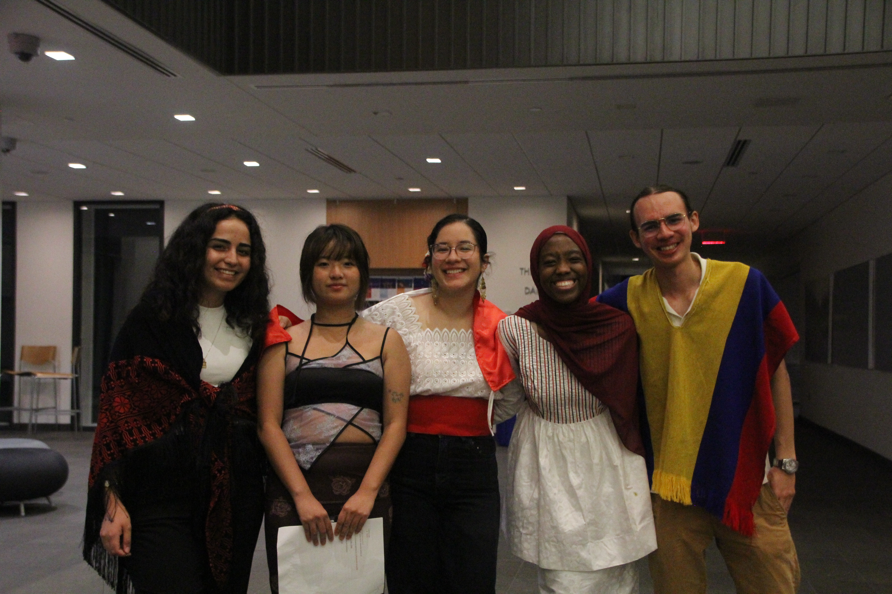
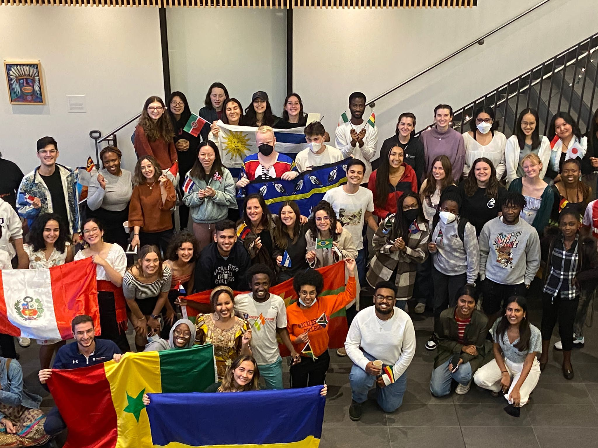

```{=html}
<!-- FULL-WIDTH INTRO -->
<section class="container-fluid px-0">
  <div class="p-5" style="background:#0b1f16; color:white;">
    <div class="container">
      <div class="row align-items-center g-4">
        <div class="col-12 col-lg-7">
          <div class="text-uppercase opacity-75" style="letter-spacing:.08em; font-size:.85rem;">
            action driven
          </div>
          <h1 class="display-5 fw-semibold mt-2"> Welcome! I am Nibia </h1>
          <p class="lead mt-3 mb-0">
            One of my biggest passions is accessibility, inclusion, and community building. I bring that passion to my personal and professional life.
            In this section I will highlight some of the experiences that have shaped the way I approach work:
          </p>
        </div>
        <div class="col-12 col-lg-5">
          
        </div>
      </div>
    </div>
  </div>
</section>

<!-- HIGHLIGHT SECTION 1 -->
<section class="container-fluid px-0">
  <div class="container py-5">
    <div class="row align-items-center g-4">
      <!-- TEXT -->
      <div class="col-12 col-lg-6">
        <h2 class="h3 fw-semibold"> Davis Projects for Peace: Prosperidad Partners </h2>
        <p class="mt-3">
          [Write 4–6 lines about what you did + what it says about how you work.]
        </p>

        <ul class="mt-3">
          <li> Managed a $10,000 cross-border project with direct impact on ~80 beneficiaries across Peru, Brazil, and the U.S. Latino community, coordinating partners across 3 countries.
Built bilingual reporting systems and stakeholder coordination frameworks for funders and community partners.
</li> 
          </li> Built bilingual reporting systems and stakeholder coordination frameworks for funders and community partners.
</li>
        </ul>
        <div class="mt-4">
        <a href="[https://www.macalester.edu/global-citizenship/student-opportunities/davis-projects-for-peace/pastprojects-2/]" class="btn btn-outline-dark">Read more</a>
        </div>
      </div>

      <!-- IMAGE OR CAROUSEL -->
      <div class="col-12 col-lg-6">
        
      </div>
    </div>
  </div>
</section>

<!-- HIGHLIGHT SECTION 2 (with carousel) -->
<section class="container-fluid px-0" style="background:#f6f7f8;">
  <div class="container py-5">
    <div class="row align-items-center g-4">
      <!-- TEXT -->
      <div class="col-12 col-lg-6 order-2 order-lg-1">
        <h2 class="h3 fw-semibold">Program Asistant at International Student Programs Office </h2>
        <p class="mt-3">
          [Write 4–6 lines. Emphasize initiative, budgeting, institutional navigation.]
        </p>
            <div class="mt-4">
            <a href="[optional_link.qmd]" class="btn btn-outline-dark">Read more</a>
            </div>
      </div>

      <!-- CAROUSEL -->
      <div class="col-12 col-lg-6 order-1 order-lg-2">
        <div id="eventsCarousel" class="carousel slide shadow" data-bs-ride="carousel">
          <div class="carousel-indicators">
            <button type="button" data-bs-target="#eventsCarousel" data-bs-slide-to="0" class="active"></button>
            <button type="button" data-bs-target="#eventsCarousel" data-bs-slide-to="1"></button>
            <button type="button" data-bs-target="#eventsCarousel" data-bs-slide-to="2"></button>
          </div>

          <div class="carousel-inner">
            <div class="carousel-item active">
              
            </div>
            <div class="carousel-item">
              
            </div>
            <div class="carousel-item">
              
            </div>
          </div>

          <button class="carousel-control-prev" type="button" data-bs-target="#eventsCarousel" data-bs-slide="prev">
            <span class="carousel-control-prev-icon"></span>
          </button>
          <button class="carousel-control-next" type="button" data-bs-target="#eventsCarousel" data-bs-slide="next">
            <span class="carousel-control-next-icon"></span>
          </button>
        </div>
      </div>
    </div>
  </div>
</section>

<!-- HIGHLIGHT SECTION 3 -->
<section class="container-fluid px-0">
  <div class="container py-5">
    <div class="row align-items-center g-4">

      <!-- TEXT -->
      <div class="col-12 col-md-6 pe-md-5">
        <h2 class="h3 fw-semibold"> Event organizing - Across multiple years </h2>
        <p class="mt-3">
          [Your 4–6 lines here...]
        </p>

        <div class="mt-4">
          <a href="YOUR_READMORE.qmd" class="btn btn-outline-dark">Read more</a>
        </div>
      </div>

      <!-- IMAGE -->
      <div class="col-12 col-md-6">
        
      </div>

    </div>
  </div>
</section>

<!-- HIGHLIGHT SECTION 4 (with carousel) -->
<section class="container-fluid px-0" style="background:#f6f7f8;">
  <div class="container py-5">
    <div class="row align-items-center g-4">
      <!-- TEXT -->
      <div class="col-12 col-lg-6 order-2 order-lg-1">
        <h2 class="h3 fw-semibold"> Fundraiser Coordinator - UWC Peru (Voluntering) </h2>
        <p class="mt-3">
          [Write 4–6 lines. Emphasize initiative, budgeting, institutional navigation.]
        </p>
            <div class="mt-4">
            <a href="[optional_link.qmd]" class="btn btn-outline-dark">Read more</a>
            </div>
      </div>

      <!-- CAROUSEL -->
      <div class="col-12 col-lg-6 order-1 order-lg-2">
        <div id="eventsCarousel" class="carousel slide shadow" data-bs-ride="carousel">
          <div class="carousel-indicators">
            <button type="button" data-bs-target="#eventsCarousel" data-bs-slide-to="0" class="active"></button>
            <button type="button" data-bs-target="#eventsCarousel" data-bs-slide-to="1"></button>
            <button type="button" data-bs-target="#eventsCarousel" data-bs-slide-to="2"></button>
          </div>

          <div class="carousel-inner">
            <div class="carousel-item active">
              
            </div>
            <div class="carousel-item">
              
            </div>
            <div class="carousel-item">
              
            </div>
          </div>

          <button class="carousel-control-prev" type="button" data-bs-target="#eventsCarousel" data-bs-slide="prev">
            <span class="carousel-control-prev-icon"></span>
          </button>
          <button class="carousel-control-next" type="button" data-bs-target="#eventsCarousel" data-bs-slide="next">
            <span class="carousel-control-next-icon"></span>
          </button>
        </div>
      </div>
    </div>
  </div>
</section>

<!-- CTA -->
<section class="container-fluid px-0" style="background:#0b1f16; color:white;">
  <div class="container py-5 text-center">
    <h2 class="h3 fw-semibold">Want to work together?</h2>
    <p class="opacity-75 mb-3">[One friendly line: what kinds of roles/collabs you’re open to.]</p>
    <a class="btn btn-light" href="mailto:nibiab.work@gmail.com">Reach out</a>
  </div>
</section>
```
