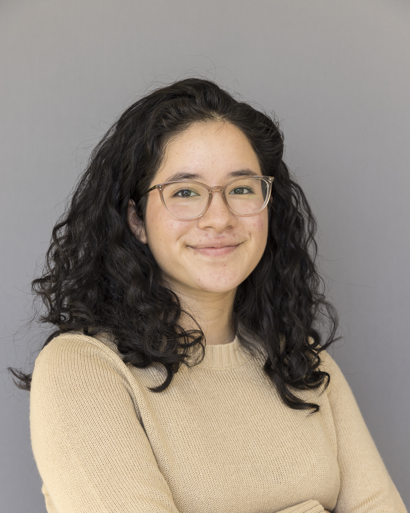

::: {.hero style="background:#556B2F; color:white; padding:2rem; text-align:center; border-radius:10px;"}
# Nibia Becerra Santillan
\
[Download My CV](CV_Nibia_Apr26_eng.pdf){.btn .btn-light .me-2} [Contact Me](mailto:nibiab.work@gmail.com){.btn .btn-light}
:::

## [About Me]{style="color: #556B2F; font-family: monospace; font-weight: bold; font-size: 20px;"}

::::: grid
::: g-col-4
{width="200px" style="border-radius: 30px;"}
:::

::: g-col-8
### Nibia Becerra Santillan

**Education:** B.A. Biology and Statistics from Macalester College, Minnesota, USA

**Short Bio:** I am a data scientist with an analytics mindset: bilingual (EN/ES), and drawn to contexts where data is scarce but the stakes are high. I've worked across product analytics, scientific research, and regulatory consulting communicating findings to technical and non-technical audiences without losing what matters.
:::
:::::

:::{.spacer style="height: 3rem;"}
:::

