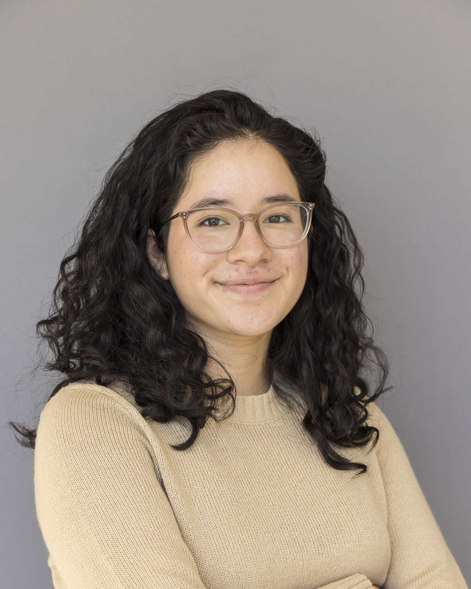

::: {.hero style="background:#556B2F; color:white; padding:2rem; text-align:center; border-radius:10px;"}
# Nibia Becerra Santillan

[Download My CV](CV_Nibia_Apr26_eng.pdf){.btn .btn-light .me-2}
[Contact Me](mailto:nibiab.work@gmail.com){.btn .btn-light}
:::

## [About me /Sobre mi]{style="color: #556B2F; font-family: monospace; font-weight: bold; font-size: 20px;"}

::::: grid
::: g-col-4
{width="200px" style="border-radius: 30px;"}
:::

::: g-col-8
### Nibia Becerra Santillan

**Education:** B.A. Biology and Statistics from Macalester College, Minnesota, USA (Homologado a GRADO DE BACHILLER EN LETRAS CON ESPECIALIZACIÓN EN BIOLOGÍA Y ESTADÍSTICA (GRADO DE BACHILLER Y TÍTULO PROFESIONAL) por SUNEDU 2026)

**Bio:** Bilingüe (EN/ES), soy excelente aplicando mi experiencia cientifica cuando formulo preguntas relevantes a los problemas que se quiere responder con los datos que se tienen. He trabajado en investigación, analitica de productos, consultoria y ONGs comunicando recomendaciones a diversas audiencias. Prueba
:::
:::::

::: {.spacer style="height: 3rem;"}
:::

