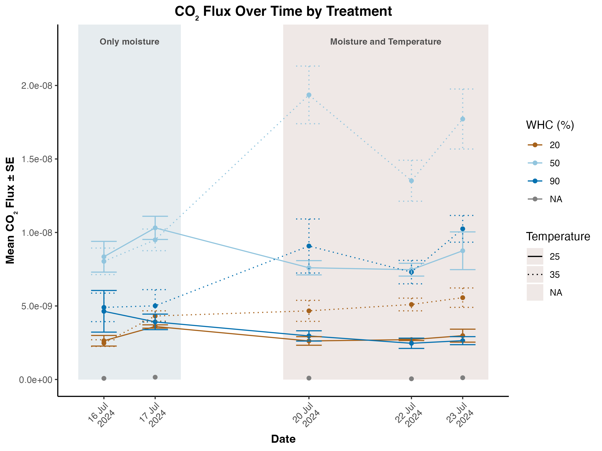
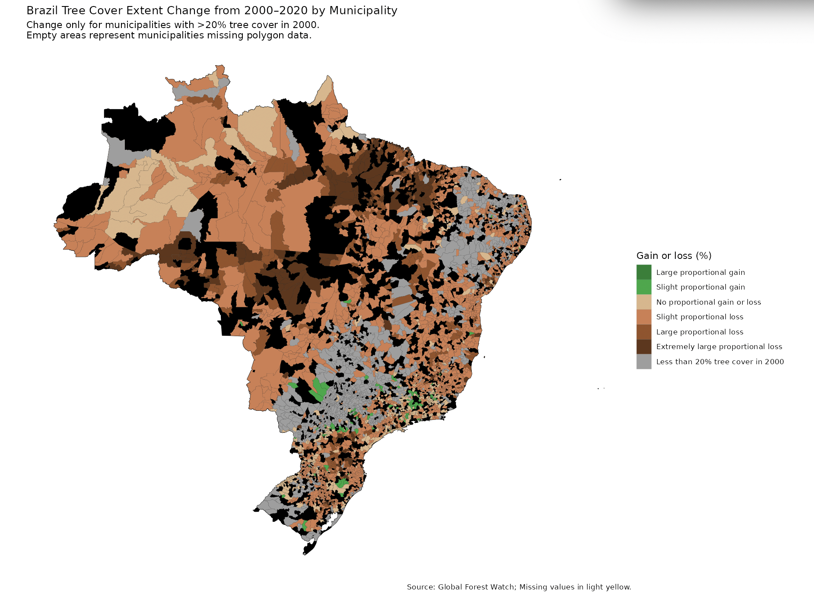
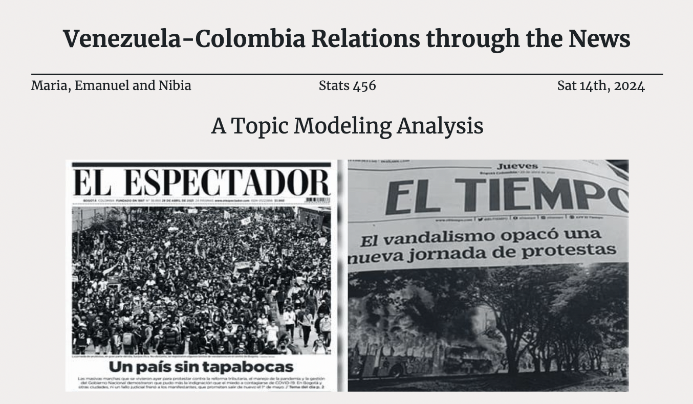

```{=html}
<!-- Filter toolbar -->
<div class="container my-4">
  <div id="filters" class="d-flex flex-wrap gap-2 mb-3">
    <button class="btn btn-sm btn-outline-secondary active" data-filter="all">All</button>
    <button class="btn btn-sm btn-outline-secondary" data-filter="Scientific Modeling">Scientific Modeling</button>
    <button class="btn btn-sm btn-outline-secondary" data-filter="Data Science">Data Science</button>
    <button class="btn btn-sm btn-outline-secondary" data-filter="R">R</button>
    <button class="btn btn-sm btn-outline-secondary" data-filter="Python">Python</button>
    <button class="btn btn-sm btn-outline-secondary" data-filter="Shiny">Shiny</button>
    <button class="btn btn-sm btn-outline-secondary" data-filter="SQL">SQL</button>
    <button class="btn btn-sm btn-outline-secondary" data-filter="Geospatial">Geospatial</button>
    <button class="btn btn-sm btn-outline-secondary" data-filter="NLP">NLP</button>
  </div>

  <!-- Projects Grid -->
  <div id="projects-grid" class="row justify-content-center g-4">

    <!-- Lab Gas Processing (Scientific Modeling) -->
    <div class="col-12 col-sm-6 col-lg-4">
      <div class="card h-100 shadow-sm project"
           data-tags="Scientific Modeling, R, tidyverse, lme4, ggplot2">
        
        <div class="card-body">
          <h5 class="card-title"><a href="LabGas.qmd">Laboratory Gas Data Processing</a></h5>
          <p class="card-text">Processed 750+ high-freq CO₂/CH₄ runs; Li-COR equations, volume corrections, mixed models, and publication-quality plots.</p>
          <span class="badge rounded-pill text-bg-secondary me-1 mb-1">Scientific Modeling</span>
          <span class="badge rounded-pill text-bg-secondary me-1 mb-1">R</span>
          <span class="badge rounded-pill text-bg-secondary me-1 mb-1">tidyverse</span>
          <span class="badge rounded-pill text-bg-secondary me-1 mb-1">lme4</span>
          <span class="badge rounded-pill text-bg-secondary me-1 mb-1">ggplot2</span>
        </div>
      </div>
    </div>

    <!-- Brazil Shiny Dashboard (Data Science) -->
    <div class="col-12 col-sm-6 col-lg-4">
      <div class="card h-100 shadow-sm project"
           data-tags="Data Science, R, Shiny, ggplot2, Geospatial, sf">
        
        <div class="card-body">
          <h5 class="card-title">
            <a href="https://fridam.shinyapps.io/bz_treecoverloss/" target="_blank" rel="noopener">
              Brazil Tree Cover Loss Dashboard
            </a>
          </h5>
          <p class="card-text">Interactive Shiny app exploring two decades of tree cover loss; merged shapefiles with political boundaries; filter by region and year.</p>
          <span class="badge rounded-pill text-bg-secondary me-1 mb-1">Data Science</span>
          <span class="badge rounded-pill text-bg-secondary me-1 mb-1">R</span>
          <span class="badge rounded-pill text-bg-secondary me-1 mb-1">Shiny</span>
          <span class="badge rounded-pill text-bg-secondary me-1 mb-1">ggplot2</span>
          <span class="badge rounded-pill text-bg-secondary me-1 mb-1">sf</span>
        </div>
      </div>
    </div>

    <!-- Clustering (Data Science) -->
    <div class="col-12 col-sm-6 col-lg-4">
      <div class="card h-100 shadow-sm project"
           data-tags="Data Science, R, Clustering, Unsupervised, PCA, k-means">
        
        <div class="card-body">
          <h5 class="card-title"><a href="Clustering.qmd">Clustering</a></h5>
          <p class="card-text">Segmented observations using unsupervised learning; compared clustering approaches and validated results with clear, decision-ready plots.</p>
          <span class="badge rounded-pill text-bg-secondary me-1 mb-1">Data Science</span>
          <span class="badge rounded-pill text-bg-secondary me-1 mb-1">R</span>
          <span class="badge rounded-pill text-bg-secondary me-1 mb-1">Clustering</span>
          <span class="badge rounded-pill text-bg-secondary me-1 mb-1">Unsupervised</span>
        </div>
      </div>
    </div>

    <!-- Difference-in-Differences (Data Science) -->
    <div class="col-12 col-sm-6 col-lg-4">
      <div class="card h-100 shadow-sm project"
           data-tags="Data Science, R, Causal Inference, DiD, Econometrics">
        
        <div class="card-body">
          <h5 class="card-title"><a href="DiD_ColombiaVenezuela.qmd">Difference-in-Differences</a></h5>
          <p class="card-text">Estimated causal impacts using DiD design with transparent assumptions, diagnostics, and interpretable visuals for non-technical audiences.</p>
          <span class="badge rounded-pill text-bg-secondary me-1 mb-1">Data Science</span>
          <span class="badge rounded-pill text-bg-secondary me-1 mb-1">R</span>
          <span class="badge rounded-pill text-bg-secondary me-1 mb-1">DiD</span>
          <span class="badge rounded-pill text-bg-secondary me-1 mb-1">Causal Inference</span>
        </div>
      </div>
    </div>

    <!-- News Text Mining (Data Science) -->
    <div class="col-12 col-sm-6 col-lg-4">
      <div class="card h-100 shadow-sm project"
           data-tags="Data Science, R, NLP, tidytext, regex, LDA">
        
        <div class="card-body">
          <h5 class="card-title"><a href="LDA_thematic_analysis/Report.qmd">News Text Mining</a></h5>
          <p class="card-text">Built extraction & preprocessing pipeline for 5,061 articles (PDF→text, regex, tokenization) enabling LDA topic modeling and trends.</p>
          <span class="badge rounded-pill text-bg-secondary me-1 mb-1">Data Science</span>
          <span class="badge rounded-pill text-bg-secondary me-1 mb-1">R</span>
          <span class="badge rounded-pill text-bg-secondary me-1 mb-1">NLP</span>
          <span class="badge rounded-pill text-bg-secondary me-1 mb-1">tidytext</span>
          <span class="badge rounded-pill text-bg-secondary me-1 mb-1">LDA</span>
        </div>
      </div>
    </div>

  </div>
</div>

<!-- Tiny filter script -->
<script>
document.addEventListener('DOMContentLoaded', function () {
  const buttons = document.querySelectorAll('#filters [data-filter]');
  const cards = document.querySelectorAll('#projects-grid .project');

  buttons.forEach(btn => {
    btn.addEventListener('click', () => {
      buttons.forEach(b => b.classList.remove('active'));
      btn.classList.add('active');

      const key = (btn.dataset.filter || 'all').toLowerCase();

      cards.forEach(card => {
        const tags = (card.dataset.tags || '').toLowerCase();
        const show = key === 'all' || tags.includes(key);

        const col = card.parentElement; // column wrapper
        if (col) col.style.display = show ? '' : 'none';
      });
    });
  });
});
</script>
```
